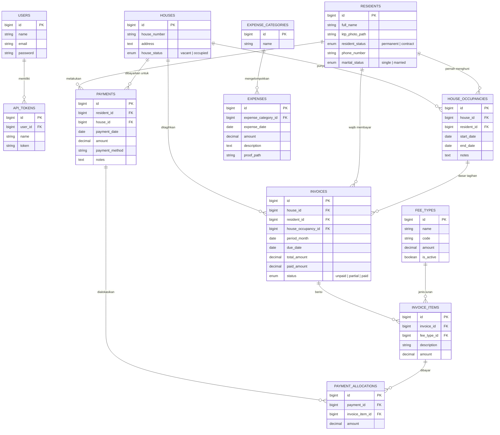

# ERD Simple - Admin Iuran RT

ERD ini dibuat sederhana agar mudah dipahami. Fokus relasinya adalah penghuni, rumah, histori hunian, tagihan iuran, pembayaran, dan pengeluaran.

## Penjelasan Singkat

- `residents` menyimpan data penghuni: nama lengkap, foto KTP, status tetap/kontrak, nomor telepon, dan status menikah.
- `houses` menyimpan data rumah dan status rumah: `occupied` untuk dihuni, `vacant` untuk tidak dihuni.
- `house_occupancies` menyimpan histori penghuni per rumah. Jika penghuni rumah berubah, data lama tetap tersimpan dengan `end_date`.
- `fee_types` menyimpan jenis iuran. Seeder membuat dua iuran utama: `Satpam` dan `Kebersihan`.
- `invoices` menyimpan tagihan iuran per rumah, penghuni, dan bulan.
- `invoice_items` menyimpan detail komponen iuran pada invoice, misalnya Satpam dan Kebersihan.
- `payments` menyimpan pembayaran yang dilakukan penghuni.
- `payment_allocations` menghubungkan pembayaran ke item invoice. Ini membuat pembayaran bisa melunasi sebagian atau beberapa item tagihan.
- `expenses` menyimpan pengeluaran RT seperti gaji satpam, token listrik, perbaikan jalan, dan perbaikan selokan.

## Alur Data Utama

1. Admin menambahkan penghuni di `residents`.
2. Admin menambahkan rumah di `houses`.
3. Admin mengisi penghuni rumah di `house_occupancies`.
4. Sistem generate invoice bulanan dari rumah yang sedang dihuni.
5. Setiap invoice berisi item iuran dari `fee_types`, yaitu Satpam dan Kebersihan.
6. Saat penghuni membayar, data masuk ke `payments`.
7. Jika pembayaran dialokasikan ke invoice item, status invoice berubah menjadi `unpaid`, `partial`, atau `paid`.
8. Pengeluaran dicatat di `expenses`.
9. Laporan bulanan mengambil total pemasukan dari `payments` dan total pengeluaran dari `expenses`.
